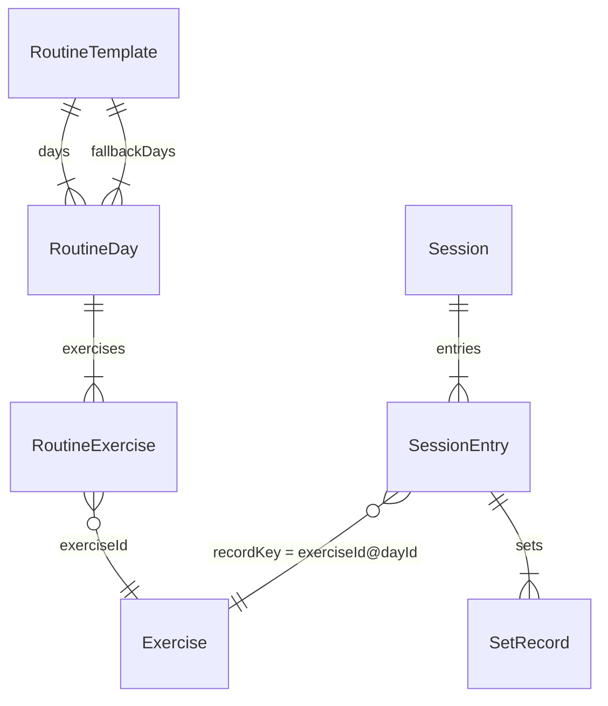
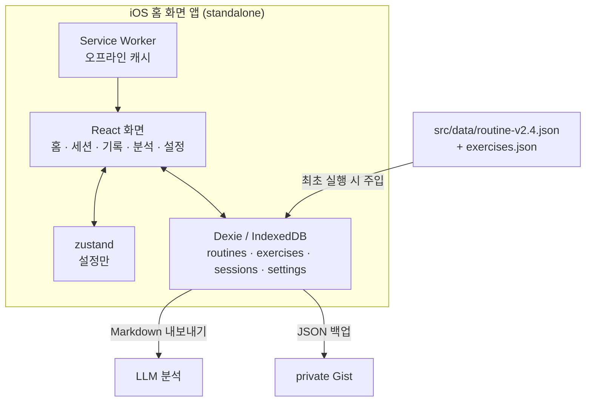

# 운동 기록 (Workout Tracker)

> 16개월간 기록이 없었던 것이 문제였다. 그래서 "기록하는 마찰"을 최소화하는 것만을 목표로 만든 1인용 운동 기록 PWA.

`React 18` · `TypeScript` · `Vite` · `Dexie (IndexedDB)` · `zustand` · `recharts` · `vite-plugin-pwa` · `GitHub Pages`

헬스장에서 세트별 반복수, 감각 점수, 보상작용, 실제 수행 순서를 실시간으로 입력하고,
그 기록을 Markdown으로 내보내 LLM에게 바로 분석시키는 것까지를 한 흐름으로 묶은 앱입니다.
서버도 로그인도 없고, 데이터는 전부 기기 안(IndexedDB)에 있습니다.

## Why

시중 운동 기록 앱은 대부분 "무게 × 반복수"만 받습니다. 하지만 제 루틴(피지크형 상체 루틴 v2.4)이
실제로 요구하는 기록은 그것만이 아닙니다.

- **감각 점수** — 머신 종목에서 목표 부위에 자극이 왔는지(0~3점). 이게 없으면 "계속 0점인 종목"을 못 잡습니다.
- **보상작용** — 승모 개입, 반동, 엉덩이 뜸 같은 신호. 빈칸으로 두면 안 되는 필수 항목입니다.
- **실제 수행 순서** — 헬스장은 기계가 비는 순서대로 하게 됩니다. 계획 순서와 수행 순서가 다른 것이 정상이고, 그 차이가 분석 대상입니다.
- **(종목, Day) 분리** — 같은 인클라인 프레스라도 Day 1(무겁게, A그룹)과 Day 4(가볍게, B그룹)는 다른 운동입니다. 무게 프리필과 증량 판단이 섞이면 안 됩니다.

그래서 다음 기준으로 풀었습니다.

- 입력 마찰 최소화가 다른 모든 것보다 우선한다. 저장 버튼도 없다 (입력 즉시 IndexedDB 반영).
- 앱은 판단을 대신하지 않고 **제안**만 한다. 증량, 디로드, 복귀 프로토콜 전부 사용자가 무시할 수 있다.
- 고급 분석은 앱에서 하지 않는다. Markdown으로 내보내 LLM에게 붙여넣는 것이 설계된 분석 경로다.
- 서버를 두지 않는다. Apple Developer 등록 없이 iOS 홈 화면 앱으로 쓸 수 있으면 충분하다.

## 핵심 설계 결정

구현 중에 임의로 바꾸면 안 되는 것들만 남깁니다. 전체 근거는 [docs/DESIGN.md](docs/DESIGN.md)에 있습니다.

- **Day 제안을 순환이 아니라 "볼륨 예산"으로 계산한다**
  D1→D2→D3→D4 순환은 부위 빈도를 보장하지 못합니다. 주 3회로 끝난 주에 하필 D4가 빠지면
  측면어깨·상부가슴·광배의 주 2회차 노출이 통째로 사라집니다. 그래서 매 세션 시작 시점에
  *이번 주 부위별 부족분 × 우선순위 가중치*로 점수를 내서 Day를 고릅니다.
  결과적으로 주 4회 순서는 **D1 → D2 → D4 → D3**이 되고, "밀려도 되는 날"이 D4에서 D3(하체)로 이동합니다.
  유지 목적인 하체 빈도가, 성장 목표인 상체 부위의 2회차보다 양보 가능하기 때문입니다.

- **"이번 주 몇 회 할 예정인가"를 묻지 않는다**
  사전 선언은 예측이 틀리면 양방향으로 깨집니다(3회 선언 후 4회 → 볼륨 초과, 4회 선언 후 3회 → 원래 문제).
  예측을 제거하고 실제 수행 이력에만 반응합니다. **제안 로직에 요일 개념이 아예 없습니다.**

- **무게 프리필은 직전 세션이 아니라 최근 3세션 최고 기록 기준**
  직전 세션을 기준점으로 쓰면 컨디션 나쁜 날의 기록이 다음 세션의 기준이 되어 하향 고착이 생깁니다.
  최고 기록을 기본값으로 넣고, 직전 기록은 비교용으로 옆에 같이 보여줍니다.

- **복귀 시 무게보다 세트·RIR을 깎는다**
  2~4주 공백에서 근력 손실은 작습니다. 무게를 크게 내리면 자극이 역치 아래로 떨어져 복귀가 더 길어집니다.
  실제 리스크는 반복부하효과 소실로 인한 근손상·DOMS이고 그건 볼륨과 실패 근접도가 지배합니다.
  그래서 무게는 −5~−20%만, 세트는 −30~−50%, RIR 3~4로 조절합니다.

- **휴식 타이머는 남은 초를 세지 않고 종료 시각을 저장한다**
  iOS PWA는 화면이 잠기면 JS 타이머가 정지합니다. `endTime = now + restSec`를 저장하고
  `visibilitychange`에서 다시 계산합니다.

- **서비스워커 업데이트는 자동 적용하지 않는다**
  `registerType: 'autoUpdate'`는 새 버전 감지 시 페이지를 리로드합니다. 세션 입력 중에
  화면이 날아가면 안 되므로 배너로 알리고 사용자가 누를 때만 적용합니다.

- **휴식 종료음의 AudioContext는 세트 체크 시점에 미리 열어둔다**
  iOS는 사용자 제스처 없이 AudioContext를 시작할 수 없습니다. 비프음이 울려야 하는 시점은
  90~150초 뒤로 제스처가 없으므로, 항상 타이머 시작 직전에 오는 제스처(세트 체크 ✓)에서
  컨텍스트를 열어둡니다. `navigator.vibrate`는 iOS 미지원이라 소리가 주 수단입니다.

- **recharts는 분석 탭만 지연 로딩한다**
  차트 3개를 위해 gzip 130KB가 붙어 앱 전체가 두 배가 됩니다. §2가 지정한 스택이므로
  바꾸지 않되, `React.lazy`로 분리해 **헬스장에서 쓰는 경로(홈 → 세션)가 차트 코드를
  파싱하지 않게** 했습니다. 서비스워커가 두 청크를 모두 precache하므로 오프라인에서
  분석 탭도 그대로 열립니다.

- **차트의 "최고 세트"는 무게가 아니라 e1RM 기준으로 뽑는다**
  무게 기준이면 `45kg × 3회`가 `40kg × 12회`를 항상 이겨서, **40kg에서 8회 → 12회로 늘린
  진전이 차트에서 사라집니다.** 더블 프로그레션 루틴에서는 진전의 대부분이 반복수 증가
  구간에 있으므로 치명적입니다.

- **Gist API가 1MB에서 응답을 자르므로 `truncated`면 `raw_url`로 다시 받는다**
  잘린 `content`를 그대로 파싱하면, 운 나쁘게 배열 경계에서 잘렸을 때 **파싱은 성공하고
  최근 세션만 사라집니다.** 복원 후 앱은 정상으로 보이고 몇 주 뒤에 알아차립니다.
  백업은 세션당 ~9KB라 100세션(주 3회로 8개월)에서 1MB에 도달합니다. raw까지 실패하면
  불완전한 복원 대신 에러를 던집니다.

- **403을 rateLimit와 scope로 구분한다**
  같은 상태 코드인데 사용자가 할 일이 정반대입니다. "권한을 고쳐라"와 "기다려라"를
  뒤집어 알려주면 잘 되던 토큰을 다시 발급하는 헛수고를 시킵니다. 네트워크 실패도
  분리합니다 — 헬스장 신호가 나쁜 것을 "토큰이 유효하지 않다"고 하면 설정을 지우게 됩니다.

- **Gist 토큰은 세 겹으로 백업에서 차단한다**
  JSON 백업은 Dexie를 통째로 덤프하고, 그 파일은 공유 시트로 나가고 Gist에 올라갑니다.
  `Settings` 타입에서 필드를 제거(localStorage 전용)하고, `db.setSetting`이 비밀 키를 예외로
  거부하고, `createBackup`이 한 번 더 필터링합니다. 세 번째가 필요한 이유는 *이미 저장된 값*
  때문입니다 — 토큰을 IndexedDB에 강제로 심고 백업을 뽑아 유출되지 않음을 확인했습니다.

- **순서 이탈 보고에서 "원인"과 "결과"를 구분한다**
  한 종목을 앞당기면 그것이 뛰어넘은 종목들이 기계적으로 +1씩 밀립니다. 그 +1은 사용자의
  결정이 아니라 결과이므로 보고하지 않습니다. 전부 나열하면 실제 결정 하나가 잡음에 묻힙니다.

- **Day를 잘못 골라 기록했을 때, 대상 Day에 없는 종목의 기록을 지우지 않는다**
  D4 → D2로 옮기면 겹치는 종목만 `recordKey`가 재매핑되고, D2에 없는 종목은 원래 키를 유지합니다.
  부위 집계·프리필·증량 판정이 모두 `recordKey` 기준이라 키를 유지하면 계산이 깨지지 않습니다.
  삭제는 되돌릴 수 없지만 "dayId와 내용이 약간 어긋난 세션"은 언제든 고칠 수 있습니다.
  확인 다이얼로그가 무엇이 재매핑되고 무엇이 유지되는지 전부 보여줍니다.

- **종목별 히스토리 목록은 루틴이 아니라 세션 기록에서 뽑는다**
  루틴을 교체해 종목이 빠져도 과거 기록을 계속 조회할 수 있어야 합니다. 루틴에 없는 키는
  "현재 루틴에 없음" 뱃지를 달고 목록 뒤로 보냅니다.

- **조기 디로드 신호는 "주간 총 반복수"가 아니라 "그 주 최고 세션의 총 반복수"로 본다**
  주간 합으로 계산하면 출석 감소와 수행 저하를 구분할 수 없습니다. 주 4회에서 주 2회로 줄면
  세션당 수행이 완전히 동일해도 총합은 반으로 떨어져 디로드 배너가 뜹니다. 디로드는 볼륨을
  절반으로 깎는 조치라 오탐 비용이 큽니다. 세션 단위 값을 쓰면 횟수에 영향받지 않습니다.

- **디로드를 수행하면 카운터를 리셋한다**
  §7은 리셋 조건으로 "4주+ 공백"만 규정합니다. 그것만으로는 8주를 채우고 디로드를 해도
  카운터가 8로 남아 배너가 영구히 뜹니다. `mode: 'deload'` 세션 다음 주부터 새로 셉니다.

- **"주 2회 노출 기대" 부위를 이름으로 하드코딩하지 않는다**
  루틴이 그 부위를 몇 개 정규 Day에서 제공하는지로 판정합니다(2개 이상 → 2x 기대).
  루틴 JSON을 교체해 부위가 추가돼도 코드를 고칠 필요가 없습니다.

- **빈도 미달 경고는 그 주가 최소 목표(주 3회)에 도달한 뒤에만 켠다**
  월요일에는 모든 부위가 0x라서, 그냥 켜면 전부 경고로 뜹니다. 상시 켜진 경고는 아무도 안 봅니다.

- **감각 점수 0점과 미입력을 구분한다**
  0점("안 느껴짐")은 유효한 기록입니다. `sensoryScore ?? 0`처럼 합치면 "계속 0점인 종목"
  탐지가 불가능해집니다. 미입력은 `undefined`로 남깁니다.

- **`isActive`(boolean)를 IndexedDB 인덱스로 쓰지 않는다**
  IndexedDB는 boolean을 유효한 키로 취급하지 않아 해당 레코드가 인덱스에서 조용히 누락됩니다.
  활성 루틴은 `settings.activeRoutineId`로 찾습니다.

## 데이터 모델



Dexie 테이블은 `routines`, `exercises`, `sessions`, `settings(key-value)` 네 개입니다.
**streak, 디로드 카운터, Phase 0 진행률은 저장하지 않고 `sessions`에서 파생 계산합니다.**
단일 진실 원천을 하나로 두어, 기록을 나중에 수정해도 모든 지표가 같이 맞춰지게 하기 위한 것입니다.

기록 라인의 키는 `${exerciseId}@${dayId}` 입니다. (예: `incline-chest-press@d1` ≠ `incline-chest-press@d4`)

## Day 자동 제안 로직

```
suggestNextDay(sessions, routine, today):
  1. 마지막 세션과 14일+ 공백  → D1 + 복귀 배너
  2. 하체(D3)를 10일+ 안 했음  → D3 (점수 무시, 계속 밀리는 것 방지)
  3. 이번 주(월~일) 부위별 수행 세트 집계
  4. score(day) = Σ 부위 ( 가중치 × min(목표 − 수행, day가 제공하는 세트) × 첫노출보너스 )
     이번 주 노출 0회인 부위 → ×1.5   (주 2회 > 주 1회 빈도 우선)
     직전 세션과 24시간 이내 + 주요 부위 겹침 → score × 0.3
  → 최고 점수 Day 제안 (탭하면 전체 Day + 하한 모드 선택 시트)
```

**첫 노출 보너스가 왜 필요한가.** 남은 세트 수만 보면 "광배 0/16의 첫 6세트"와
"측면어깨 7/11의 남은 4세트"가 같은 무게로 취급됩니다. 그러면 D1 직후에 D2(광배 10세트)가
아니라 D4(여러 부위를 조금씩)가 뽑히고, 주 2회 노출을 방어하려던 로직의 목적이 사라집니다.
배수의 유효 구간은 (1.176, 1.892)로 좁게 결정되며 — 그 밖에서는 다른 케이스가 깨집니다 —
경계에서 가장 먼 1.5를 씁니다. 이 부등식은 [테스트](src/lib/suggestNextDay.test.ts)로 고정돼 있습니다.

**"주요 부위"의 정의.** 회복 감쇠에 쓰이는 주요 부위는 *그 Day 총 세트의 25% 이상*을
차지하는 부위입니다. 겹침을 느슨하게 잡으면 (예: 세트 수 3 이상) D1과 D2가 `팔`로 겹쳐서
거의 모든 Day가 같이 감점되고 제약이 무의미해집니다.

| 부위 | 목표 세트/주 | 가중치 |
|---|---|---|
| 측면어깨 | 11 | 1.00 |
| 상부가슴 | 10 | 0.90 |
| 광배 | 16 | 0.85 |
| 후면어깨 | 7 | 0.70 |
| 팔 | 6 | 0.50 |
| 하체 | 9 | 0.45 |
| 가슴(플랫) | 3 | 0.40 |
| 코어 | 5 | 0.30 |

## Architecture



## Tech Stack

- 빌드: Vite, TypeScript
- UI: React 18 (라우터 없음 — 탭 4개라 상태로 충분)
- 상태: zustand (설정만. 루틴·세션은 `dexie-react-hooks`의 live query로 직접 읽음)
- 저장: Dexie (IndexedDB)
- PWA: vite-plugin-pwa (manifest + Workbox SW)
- 테스트: Vitest (알고리즘 단위 테스트 169개)
- 배포: GitHub Actions → GitHub Pages

## Getting Started

```bash
npm install
npm run dev
```

`http://localhost:5173/workout-tracker/` 로 접속합니다. (Pages 하위 경로와 맞추기 위해 `base`가 `/workout-tracker/`입니다)

```bash
npm run build
npm run preview
```

Day 제안 알고리즘·프리필·수행 순서·보상작용 직렬화·타이머 산술은 자동 테스트로 고정돼 있습니다.

```bash
npm test
```

## 배포

`main`에 push하면 GitHub Actions가 빌드 후 Pages에 올립니다
([.github/workflows/deploy.yml](.github/workflows/deploy.yml)).

**iOS에서 쓰는 방법:** Safari로 배포 주소를 열고 공유 → **홈 화면에 추가**.
Safari 탭으로만 쓰면 iOS가 7일 미사용 시 IndexedDB를 지울 수 있습니다. 홈 화면 앱은 그 대상에서 제외됩니다.
앱 첫 실행 온보딩이 이 안내를 강제로 보여주고, 홈 화면 앱이 아니면 상단에 경고를 계속 띄웁니다.

## 내보내기

Markdown은 LLM 대화창에 붙여넣는 것이 목적이므로 `navigator.share({ text })`로,
JSON 백업은 파일 앱에 보관하는 것이 목적이므로 `navigator.share({ files })`로 넘깁니다.
공유가 불가능한 환경에서는 클립보드 복사 → 파일 다운로드로 내려갑니다.

```markdown
# 운동 기록 2026-07-18 ~ 2026-07-31

## 2026-07-27 (월) — Day 1 Push  [18:02–19:41, 99분]
수행 순서: 인클라인 프레스 → 레터럴 레이즈 → 펙덱 플라이 → 체스트프레스
(계획 대비: 레터럴 레이즈를 2번째로 앞당김)

### 인클라인 프레스 (D1/A) 30kg
8 / 7 / 6 / 5
보상작용: 마지막 세트 엉덩이 살짝 뜸
다음: 30kg 유지

### 레터럴 레이즈 (D1/B) 6kg
14 / 13 / 12 / 11
감각: 3점 — 측면 확실
보상작용: 없음

미수행: 푸쉬다운
메모: 컨디션 좋음
```

`다음: 유지/증량`은 더블 프로그레션 규칙으로 자동 산출됩니다.
`[디로드]`/`[복귀]` 표시와 `미수행:` 줄은 없으면 세트 감소를 수행 저하로 오독하게 되므로 포함합니다.

## 구현 현황

| 마일스톤 | 내용 | 상태 |
|---|---|---|
| 1 | 스캐폴드 — Vite/React/TS/Dexie/PWA, 시드 로딩, Pages 배포 | ✅ |
| 2 | 세션 코어 — Day 제안, 세트 입력·프리필·체크, 즉시 저장, 종료 요약 | ✅ |
| 3 | 휴식 타이머, 감각 점수, 보상작용 체크리스트 | ✅ |
| 4 | 홈 대시보드 — 주간 도트, 부위별 볼륨 바, 복귀/디로드/증량 배너 | ✅ |
| 5 | 기록 탭 — 달력, 세션 상세, 편집, 종목별 히스토리 | ✅ |
| 6 | 내보내기/가져오기 — Markdown, JSON, 루틴 교체, iOS 공유 시트 | ✅ |
| 7 | Gist 백업 — secret gist 자동 동기화, 복원, 리마인드 | ✅ |
| 8 | 분석 탭 + PWA 마감 — 차트, 오프라인 검증, 스플래시 | ✅ |

마일스톤 2까지가 MVP였고, **v1 전 마일스톤이 완료됐습니다.**

오프라인 동작은 프로덕션 빌드를 띄운 뒤 **서버 프로세스를 죽이고** 확인했습니다 —
앱 셸 로드, 세션 기록(타이머·저장), 분석 탭의 지연 로딩 청크까지 네트워크 없이 동작하며,
서비스워커 업데이트도 오프라인에서 적용됩니다(새 SW가 미리 precache되므로).

## Limitations

- **1인용입니다.** 다중 사용자, 로그인, 서버 동기화가 없습니다. 기기를 바꾸면 JSON 내보내기/가져오기나 Gist 백업으로 옮겨야 합니다.
- 특정 루틴(피지크형 상체 루틴 v2.4)의 기록 방식에 맞춰 설계됐습니다. 루틴 자체는 JSON으로 교체할 수 있지만, 감각 점수·보상작용 같은 기록 항목 구조는 고정입니다.
- 체중, 식단, 인바디는 기록하지 않습니다 (별도 앱으로 관리 중).
- Gist 백업용 토큰은 코드에 없습니다. 사용자가 직접 입력해 `localStorage`에만 저장하고, 마스킹해서만 표시합니다. 백업 파일·에러 메시지·URL·요청 본문 어디에도 들어가지 않습니다(테스트로 고정). 이 레포는 public이므로 토큰을 커밋하면 안 됩니다.
- Gist는 secret gist입니다 — URL을 아는 사람은 볼 수 있습니다. GitHub에 완전 비공개 gist는 없습니다.
- 알림(Notification API)은 v1에 없습니다. 휴식 타이머 종료는 화면이 켜져 있을 때 소리·진동으로만 알립니다.
