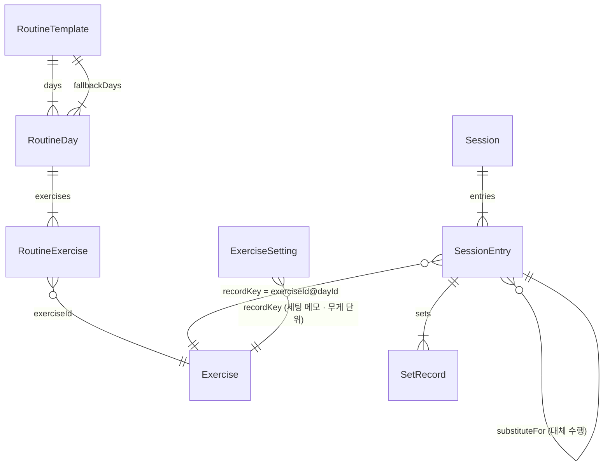
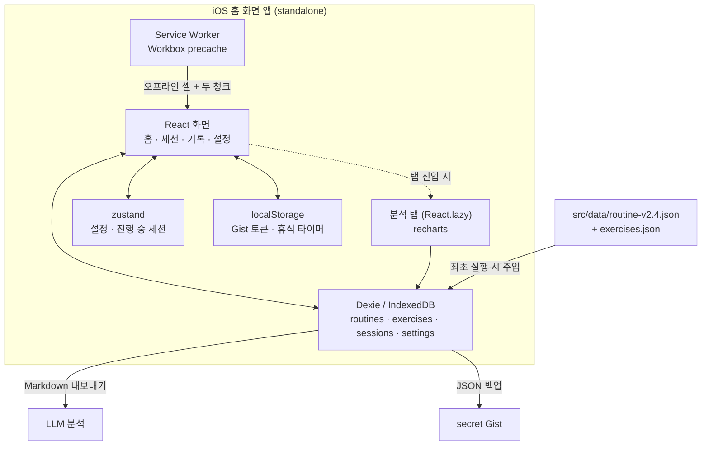

# 운동 기록 (Workout Tracker)

> 16개월간 기록이 없었던 것이 문제였다. 그래서 "기록하는 마찰"을 최소화하는 것만을 목표로 만든 1인용 운동 기록 PWA.

`React 18` · `TypeScript` · `Vite` · `Dexie (IndexedDB)` · `zustand` · `recharts` · `vite-plugin-pwa` · `GitHub Pages`

**[https://joyanggi.github.io/workout-tracker/](https://joyanggi.github.io/workout-tracker/)**

헬스장에서 세트별 반복수, 감각 점수, 보상작용, 실제 수행 순서를 실시간으로 입력하고,
그 기록을 Markdown으로 내보내 LLM에게 바로 분석시키는 것까지를 한 흐름으로 묶은 앱입니다.
서버도 로그인도 없고, 데이터는 전부 기기 안(IndexedDB)에 있습니다.

## Why

시중 운동 기록 앱은 대부분 "무게 × 반복수"만 받습니다. 하지만 제 루틴(피지크형 상체 루틴 v2.4)이
실제로 요구하는 기록은 그것만이 아닙니다.

- **감각 점수** — 머신 종목에서 목표 부위에 자극이 왔는지(0~3점). 이게 없으면 "계속 0점인 종목"을 못 잡습니다.
- **보상작용** — 승모 개입, 반동, 엉덩이 뜸 같은 신호. 빈칸으로 두면 안 되는 필수 항목입니다.
- **실제 수행 순서** — 헬스장은 기계가 비는 순서대로 하게 됩니다. 계획 순서와 수행 순서가 다른 것이 정상이고, 그 차이가 분석 대상입니다.
- **(종목, Day) 분리** — 같은 인클라인 프레스라도 Day 1(무겁게, A그룹)과 Day 4(가볍게, B그룹)는 다른 운동입니다. 무게 프리필과 증량 판단이 섞이면 안 됩니다.

그래서 다음 기준으로 풀었습니다.

- 입력 마찰 최소화가 다른 모든 것보다 우선한다. **저장 버튼이 없다** (입력 즉시 IndexedDB 반영).
- 앱은 판단을 대신하지 않고 **제안**만 한다. 증량, 디로드, 복귀 프로토콜 전부 사용자가 무시할 수 있다.
- 고급 분석은 앱에서 하지 않는다. Markdown으로 내보내 LLM에게 붙여넣는 것이 설계된 분석 경로다.
- 서버를 두지 않는다. Apple Developer 등록 없이 iOS 홈 화면 앱으로 쓸 수 있으면 충분하다.

## 기능

| 탭 | 내용 |
|---|---|
| **홈** | Day 자동 제안 + 근거, 주간 도트, 부위별 볼륨 바, Phase 진행률, 디로드 카운터, 복귀·디로드·Phase 전환·증량·백업 배너 |
| **세션** | 접힘/펼침 운동 카드, 종목별 자극 팁, 머신 세팅 메모, 종목별 무게 단위, 롱프레스 가속 스테퍼, 세트 체크 → 휴식 타이머(3·2·1 카운트다운 + 종료 차임), 워밍업 세트, 대체운동 + 무게 환산, **템포 가이드**(수축·이완 리듬 + 반복수 자동 입력), 감각 점수, 보상작용 반복 경고, 수행 순서 자동 기록 |
| **기록** | 월 달력(불꽃 + 식단 준수 링), 세션 상세 + 편집, 식단 과거 보정, 종목별 히스토리, Day 재매핑 |
| **분석** | 종목별 추이(무게×횟수 / 볼륨 / e1RM, B그룹은 Phase 2부터), 감각 점수 4주 히트맵, 주간 수행 횟수, 대체 수행 빈도 |
| **식단** | 플랜 2종(감량/보정) 전환, 슬롯별 1탭 일괄 체크, 대체·**추가 섭취** 기록(자가 태그 3단), 훈련일/휴식일 세그먼트, 단백질 진행, 일 기록 삭제 |
| **설정** | Phase 전환 + 조건 체크리스트, 루틴·식단 플랜 JSON 교체, Markdown/JSON 내보내기, JSON 복원, Gist 백업 |

## 핵심 설계 결정

구현하면서 내린 판단과 그 근거입니다. 설계 문서의 운동학적 근거는 [docs/DESIGN.md](docs/DESIGN.md)에,
구현 중에 겪은 함정과 진단 과정은 개인 개발 노트에 따로 정리했습니다.
(아래 §번호는 모두 [docs/DESIGN.md](docs/DESIGN.md)의 절 번호입니다)

### 운동학 · 루틴 로직

- **Day 제안을 순환이 아니라 "볼륨 예산"으로 계산한다** (§4)
  D1→D2→D3→D4 순환은 부위 빈도를 보장하지 못합니다. 주 3회로 끝난 주에 하필 D4가 빠지면
  측면어깨·상부가슴·광배의 주 2회차 노출이 통째로 사라집니다. 그래서 매 세션 시작 시점에
  *이번 주 부위별 부족분 × 우선순위 가중치*로 점수를 내서 Day를 고릅니다.
  결과적으로 주 4회 순서는 **D1 → D2 → D4 → D3**이 되고, "밀려도 되는 날"이 D4에서 D3(하체)로 이동합니다.
  유지 목적인 하체 빈도가, 성장 목표인 상체 부위의 2회차보다 양보 가능하기 때문입니다.

- **"이번 주 몇 회 할 예정인가"를 묻지 않는다** (§4)
  사전 선언은 예측이 틀리면 양방향으로 깨집니다(3회 선언 후 4회 → 볼륨 초과, 4회 선언 후 3회 → 원래 문제).
  예측을 제거하고 실제 수행 이력에만 반응합니다. **제안 로직에 요일 개념이 아예 없습니다.**

- **무게 프리필은 직전 세션이 아니라 최근 3세션 최고 기록 기준** (§5.2)
  직전 세션을 기준점으로 쓰면 컨디션 나쁜 날의 기록이 다음 세션의 기준이 되어 하향 고착이 생깁니다.
  최고 기록을 기본값으로 넣고, 직전 기록은 비교용으로 옆에 같이 보여줍니다.

- **복귀 시 무게보다 세트·RIR을 깎는다** (§7)
  2~4주 공백에서 근력 손실은 작습니다. 무게를 크게 내리면 자극이 역치 아래로 떨어져 복귀가 더 길어집니다.
  실제 리스크는 반복부하효과 소실로 인한 근손상·DOMS이고 그건 볼륨과 실패 근접도가 지배합니다.
  그래서 무게는 −5~−20%만, 세트는 −30~−50%, RIR 3~4로 조절합니다.

- **조기 디로드 신호는 "주간 총 반복수"가 아니라 "그 주 최고 세션의 총 반복수"로 본다**
  주간 합으로 계산하면 출석 감소와 수행 저하를 구분할 수 없습니다. 주 4회에서 주 2회로 줄면
  세션당 수행이 완전히 동일해도 총합은 반으로 떨어져 디로드 배너가 뜹니다. 디로드는 볼륨을
  절반으로 깎는 조치라 오탐 비용이 큽니다. 세션 단위 값을 쓰면 횟수에 영향받지 않습니다.

- **디로드를 수행하면 카운터를 리셋한다**
  §7은 리셋 조건으로 "4주+ 공백"만 규정합니다. 그것만으로는 8주를 채우고 디로드를 해도
  카운터가 8로 남아 배너가 영구히 뜹니다. `mode: 'deload'` 세션 다음 주부터 새로 셉니다.

- **"주 2회 노출 기대" 부위를 이름으로 하드코딩하지 않는다**
  루틴이 그 부위를 몇 개 정규 Day에서 제공하는지로 판정합니다(2개 이상 → 2x 기대).
  루틴 JSON을 교체해 부위가 추가돼도 코드를 고칠 필요가 없습니다.

- **빈도 미달 경고는 그 주가 최소 목표(주 3회)에 도달한 뒤에만 켠다**
  월요일에는 모든 부위가 0x라서, 그냥 켜면 전부 경고로 뜹니다. 상시 켜진 경고는 아무도 안 봅니다.

- **차트의 "최고 세트"는 무게가 아니라 e1RM 기준으로 뽑는다**
  무게 기준이면 `45kg × 3회`(e1RM 49.5)가 `40kg × 12회`(e1RM 56)를 항상 이겨서,
  **40kg에서 8회 → 12회로 늘린 진전이 차트에서 사라집니다.** 더블 프로그레션 루틴에서는
  진전의 대부분이 반복수 증가 구간에 있으므로 치명적입니다.

### 기록의 정확성

- **대체운동의 부위 집계는 원 종목을 따라간다**
  대체 종목은 루틴에 없으므로 각 호출부가 루틴을 직접 조회하면 `undefined`가 되고
  **대체한 세트의 볼륨이 조용히 0으로 사라집니다.** 그러면 §4 볼륨 예산이 같은 부위를
  또 배정합니다. `routineExerciseOfEntry()` 한 곳에서 원 종목 계획을 되짚고,
  기록 라인(`recordKey`)만 대체 종목 자신의 것으로 분리해 프리필·증량·PR이 섞이지
  않게 합니다.

- **어시스티드 머신은 증량 방향이 반대다**
  보조 무게는 클수록 쉽습니다. 그대로 두면 전 세트 상단을 채운 사용자에게 더블
  프로그레션이 "+2.5kg"(= 더 쉽게 하라)를 제안합니다. `inverseWeight`로 표시하고
  `nextWeightForProgression()` 한 곳에서 방향을 뒤집습니다.

- **종목 간 하중 환산에 검증된 공식이 없다는 것을 코드가 드러낸다**
  머신 표시 무게는 브랜드·지렛대 구조에 따라 실제 부하가 달라 원리적으로 불가능합니다.
  그래서 휴리스틱(`startWeightFor`, 코칭 관행)과 실측 기반(`calibratedWeight`, Epley 역산)을
  **다른 함수로 분리**했습니다. 첫 세트를 RIR 3~4로 수행하면 2세트부터는 추정 계수가
  전혀 개입하지 않습니다.

- **식단 플랜의 요약 라벨을 손으로 적지 않고 항목 합계에서 파생시킨다**
  계획 문서의 표기(1,796kcal)와 항목 합계(1,781kcal)가 실제로 15kcal 어긋나 있었고,
  보정 플랜 단백질도 문서는 166g이었지만 현미밥을 빼면 162g입니다. 라벨을 저장하면
  항목을 고칠 때 남아서 **화면이 서로 다른 숫자를 말합니다.**

- **식단 기록은 read-modify-write 트랜잭션으로 쓴다**
  일괄 체크가 주 경로라 슬롯 6개를 빠르게 연타하는 것이 정상 사용입니다. 렌더 시점 값으로
  저장하면 live query 갱신 전 다음 탭이 낡은 값을 읽어 **앞선 기록을 덮어씁니다**
  (실측에서 6탭 중 1슬롯이 사라졌습니다).

- **신호를 폰 스피커가 낼 수 있는 대역에 둔다**
  v1.2는 카운트다운 틱을 "짧고 낮게"(330Hz·80ms) 만들어 종료 차임과 구분했습니다.
  구분은 됐지만 **들리지 않았습니다.** 실효 음량을 계산해 보니 차임보다 약 31dB
  작았고, 그중 23dB가 주파수와 길이에서 왔습니다 — 소형 스피커는 공진(수백 Hz)
  아래로 급히 떨어지고, 80ms는 귀의 적분 창(~200ms)보다 짧습니다. 게인만 올리면
  차임도 함께 커져 **격차가 오히려 벌어집니다.**
  그래서 구분 근거를 높이에서 **형태**로 옮겼습니다: 틱은 같은 음 하나,
  마지막 사이클 큐는 높은 음 둘, 종료 차임은 올라가는 셋. 셋 다 스피커가 잘 내는
  대역에 있고, 음 개수만으로도 구분됩니다.

- **오디오 세션을 `ambient`로 지정한다**
  기본 세션으로 잡히면 iOS가 이 앱을 "재생 앱"으로 보고 다른 앱의 음악을 중단시킵니다 —
  운동 중 음악이 끊기는 것이 실사용 피드백이었습니다. **AudioContext를 만들기 전에**
  지정해야 하고(순서가 뒤바뀌면 이미 잡힌 뒤에 바꾸는 셈), 백그라운드 복귀 때도 다시
  지정합니다. ambient는 무음 스위치를 존중하므로 "무음이면 소리 없음"이 정상 동작입니다.

- **타이밍은 전부 경과 시간에서 파생한다** (휴식 타이머 · 카운트다운 틱 · 템포 가이드)
  프레임마다 카운터를 더하면 화면이 잠긴 동안 시간이 멈추고, 복귀 순간 밀린 신호가
  몰아서 재생됩니다. 같은 경과 시간이면 몇 번 계산해도 같은 위치가 나오는 순수 함수로
  두면 복귀 즉시 정확합니다.

- **워밍업 제외를 `doneSets()` 한 곳에서 한다**
  볼륨·증량 판정·PR·Phase 조건·내보내기·부위별 집계가 모두 이 함수를 통과합니다.
  각 호출부에서 필터하면 한 군데만 빠뜨려도 조용히 틀린 숫자가 나옵니다.
  표시용 카운트는 `doneSetsAll()`로 워밍업까지 보여줍니다 — 내가 한 세트이므로.

- **PR 판정에서 디로드·복귀 세션을 판정 대상에서도, 이전 최고값 계산에서도 제외한다**
  가벼운 무게로 많이 한 디로드 기록이 기준선이 되면 이후 반복 PR이 영구히 막힙니다.

- **B그룹은 "제안"과 "절대 기준"을 다르게 처리한다**
  무게 회복 힌트는 프리필을 바꾸지 않습니다 — B그룹 성공 기준은 기록이 아니라 감각이라
  올릴지는 사용자 결정입니다. 반면 "감각 1점이면 이전 무게로 복귀"는 루틴 문서가
  **절대 기준**이라고 못 박은 규칙이라 프리필을 자동으로 내립니다. 같은 화면의 두 신호가
  강제력이 다르면 코드에서도 달라야 합니다.

- **반복 보상작용의 판정 창은 "그 종목을 수행한 세션" 기준이다**
  달력상 최근 3세션으로 세면 Day가 다른 세션이 끼어들어 "3세션 중 2회"가 실제로는
  "6주 중 2회"가 됩니다. 수행하지 않은 세션도 창에 넣지 않습니다 — "안 했다"가
  "문제 없었다"로 세지면 경고가 늦게 뜹니다.

- **Phase 감각 조건은 평균이 아니라 중앙값으로 본다**
  `2/0/2`는 중앙값 2(통과)·평균 1.33(미달)입니다. 컨디션 나쁜 하루가 Phase 전환을
  막으면 안 됩니다.

- **감각 점수 0점과 미입력을 구분한다**
  0점("안 느껴짐")은 유효한 기록입니다. `sensoryScore ?? 0`처럼 합치면 "계속 0점인 종목"
  탐지가 불가능해집니다. 미입력은 `undefined`로 남깁니다.

- **순서 이탈 보고에서 "원인"과 "결과"를 구분한다**
  한 종목을 앞당기면 그것이 뛰어넘은 종목들이 기계적으로 +1씩 밀립니다. 그 +1은 사용자의
  결정이 아니라 결과이므로 보고하지 않습니다. 전부 나열하면 실제 결정 하나가 잡음에 묻힙니다.

- **Day를 잘못 골라 기록했을 때, 대상 Day에 없는 종목의 기록을 지우지 않는다** (§11)
  D4 → D2로 옮기면 겹치는 종목만 `recordKey`가 재매핑되고, D2에 없는 종목은 원래 키를 유지합니다.
  부위 집계·프리필·증량 판정이 모두 `recordKey` 기준이라 키를 유지하면 계산이 깨지지 않습니다.
  삭제는 되돌릴 수 없지만 "dayId와 내용이 약간 어긋난 세션"은 언제든 고칠 수 있습니다.
  확인 다이얼로그가 무엇이 재매핑되고 무엇이 유지되는지 전부 보여줍니다.

- **종목별 히스토리 목록은 루틴이 아니라 세션 기록에서 뽑는다**
  루틴을 교체해 종목이 빠져도 과거 기록을 계속 조회할 수 있어야 합니다. 루틴에 없는 키는
  "현재 루틴에 없음" 뱃지를 달고 목록 뒤로 보냅니다.

- **`isActive`(boolean)를 IndexedDB 인덱스로 쓰지 않는다**
  IndexedDB는 boolean을 유효한 키로 취급하지 않아 해당 레코드가 인덱스에서 조용히 누락됩니다.
  활성 루틴은 `settings.activeRoutineId`로 찾습니다.

### iOS · PWA

- **휴식 타이머는 남은 초를 세지 않고 종료 시각을 저장한다** (§5.2)
  iOS PWA는 화면이 잠기면 JS 실행이 멈춥니다. 카운터를 깎는 방식이면 잠긴 60초 동안 시간이
  흐르지 않아, 복귀했을 때 이미 끝났어야 하는 타이머가 "1:10 남음"을 보여줍니다.
  `endTime = now + restSec`를 저장하고 매 틱마다 재계산하면 복귀 즉시 정확합니다.

- **서비스워커 업데이트는 자동 적용하지 않는다**
  `registerType: 'autoUpdate'`는 새 버전 감지 시 페이지를 리로드합니다. 세션 입력 중에
  화면이 날아가면 안 되므로 배너로 알리고 사용자가 누를 때만 적용합니다.

- **휴식 종료음의 AudioContext는 세트 체크 시점에 미리 열어둔다**
  iOS는 사용자 제스처 없이 AudioContext를 시작할 수 없습니다. 비프음이 울려야 하는 시점은
  90~150초 뒤로 제스처가 없으므로, 항상 타이머 시작 직전에 오는 제스처(세트 체크 ✓)에서
  컨텍스트를 열어둡니다. `navigator.vibrate`는 iOS 미지원이라 소리가 주 수단입니다.

- **recharts는 분석 탭만 지연 로딩한다**
  차트 3개를 위해 gzip 112KB가 붙어 앱 전체가 두 배가 됩니다. 설계 문서(§2 스택 표)가
  지정한 스택이므로 바꾸지 않되, `React.lazy`로 분리해 **헬스장에서 쓰는 경로(홈 → 세션)가
  차트 코드를 파싱하지 않게** 했습니다. 서비스워커가 두 청크를 모두 precache하므로
  오프라인에서 분석 탭도 그대로 열립니다.

  분석 탭 청크가 메인 번들과 비슷한 크기입니다 (recharts). 정확한 값은
  `npm run build` 출력이 말해줍니다 — 여기 적어두면 코드가 커질 때마다 낡습니다.

### 백업 · 비밀값

- **Gist 토큰은 세 겹으로 백업에서 차단한다** (§11)
  JSON 백업은 Dexie를 통째로 덤프하고, 그 파일은 공유 시트로 나가고 Gist에 올라갑니다.
  `Settings` 타입에서 필드를 제거(localStorage 전용)하고, `db.setSetting`이 비밀 키를 예외로
  거부하고, `createBackup`이 한 번 더 필터링합니다. 세 번째가 필요한 이유는 *이미 저장된 값*
  때문입니다 — 토큰을 IndexedDB에 강제로 심고 백업을 뽑아 유출되지 않음을 확인했습니다.

- **Gist API가 1MB에서 응답을 자르므로 `truncated`면 `raw_url`로 다시 받는다**
  잘린 `content`를 그대로 파싱하면, 운 나쁘게 배열 경계에서 잘렸을 때 **파싱은 성공하고
  최근 세션만 사라집니다.** 복원 후 앱은 정상으로 보이고 몇 주 뒤에 알아차립니다.
  백업 크기는 고정분(루틴 + 종목 카탈로그)에 세션당 증가분이 붙는 구조입니다.
  1MB 도달 시점은 **세션 수백 건 규모**이고, 실측은 설정 → 내보내기의 JSON 크기로
  확인합니다 (수치를 문서에 적어두면 낡습니다 — 실제로 두 번 낡았습니다).
  raw까지 실패하면 불완전한 복원 대신 에러를 던집니다.

- **403을 rateLimit와 scope로 구분한다**
  같은 상태 코드인데 사용자가 할 일이 정반대입니다. "권한을 고쳐라"와 "기다려라"를
  뒤집어 알려주면 잘 되던 토큰을 다시 발급하는 헛수고를 시킵니다. 네트워크 실패도
  분리합니다 — 헬스장 신호가 나쁜 것을 "토큰이 유효하지 않다"고 하면 설정을 지우게 됩니다.

## 데이터 모델



Dexie 테이블은 `routines`, `exercises`, `sessions`, `settings(key-value)`, `exerciseNotes`,
`dietPlans`, `dietDays` 일곱 개입니다 (스키마 v3 — `exerciseNotes` 행이 머신 세팅 메모와
무게 단위를 함께 담고, `dietDays`는 날짜가 PK라 "하루 하나"를 스키마가 강제합니다).
**streak, 디로드 카운터, Phase 0 진행률은 저장하지 않고 `sessions`에서 파생 계산합니다.**
단일 진실 원천을 하나로 두어, 기록을 나중에 수정해도 모든 지표가 같이 맞춰지게 하기 위한 것입니다.

기록 라인의 키는 `${exerciseId}@${dayId}` 입니다. (예: `incline-chest-press@d1` ≠ `incline-chest-press@d4`)
하한 모드(Push/Pull 축소)는 `recordDayId`로 정규 Day의 기록 라인에 얹어, 프리필과 증량 판단이
끊기지 않게 합니다.

## Day 자동 제안 로직

```
suggestNextDay(sessions, routine, today):
  1. 마지막 세션과 14일+ 공백  → D1 + 복귀 배너
  2. 하체(D3)를 10일+ 안 했음  → D3 (점수 무시, 계속 밀리는 것 방지)
  3. 이번 주(월~일) 부위별 수행 세트 집계
  4. score(day) = Σ 부위 ( 가중치 × min(목표 − 수행, day가 제공하는 세트) × 첫노출보너스 )
     이번 주 노출 0회인 부위 → ×1.5   (주 2회 > 주 1회 빈도 우선)
     직전 세션과 24시간 이내 + 주요 부위 겹침 → score × 0.3
  → 최고 점수 Day 제안 (탭하면 전체 Day + 하한 모드 선택 시트)
```

**첫 노출 보너스가 왜 필요한가.** 남은 세트 수만 보면 "광배 0/16의 첫 6세트"와
"측면어깨 7/11의 남은 4세트"가 같은 무게로 취급됩니다. 그러면 D1 직후에 D2(광배 10세트)가
아니라 D4(여러 부위를 조금씩)가 뽑히고, 주 2회 노출을 방어하려던 로직의 목적이 사라집니다.
배수의 유효 구간은 (1.176, 1.892)로 좁게 결정되며 — 그 밖에서는 다른 케이스가 깨집니다 —
경계에서 가장 먼 1.5를 씁니다. 이 부등식은 [테스트](src/lib/suggestNextDay.test.ts)로 고정돼 있습니다.

**"주요 부위"의 정의.** 회복 감쇠에 쓰이는 주요 부위는 *그 Day 총 세트의 25% 이상*을
차지하는 부위입니다. 겹침을 느슨하게 잡으면 (예: 세트 수 3 이상) D1과 D2가 `팔`로 겹쳐서
거의 모든 Day가 같이 감점되고 제약이 무의미해집니다.

| 부위 | 목표 세트/주 | 가중치 |
|---|---|---|
| 측면어깨 | 11 | 1.00 |
| 상부가슴 | 10 | 0.90 |
| 광배 | 16 | 0.85 |
| 후면어깨 | 7 | 0.70 |
| 팔 | 6 | 0.50 |
| 하체 | 9 | 0.45 |
| 가슴(플랫) | 3 | 0.40 |
| 코어 | 5 | 0.30 |

## Architecture



## Tech Stack

- 빌드: Vite, TypeScript
- UI: React 18 (라우터 없음 — 탭 4개라 상태로 충분)
- 상태: zustand (설정 · 진행 중 세션 · 휘발성 UI 상태만. 나머지는 `dexie-react-hooks` live query로 직접 읽음)
- 저장: Dexie (IndexedDB, 스키마 v3) + localStorage (비밀값·휴식 타이머·백업 대기 플래그)
- 차트: recharts (분석 탭만 `React.lazy`로 지연 로딩)
- PWA: vite-plugin-pwa (manifest + Workbox SW), iOS 스플래시 8종
- 테스트: Vitest (알고리즘·파생 계산 단위 테스트, CI에서 배포 전 실행). 개수는 `npm test`가 말해줍니다
- 배포: GitHub Actions → GitHub Pages

## 프로젝트 구조

```
src/
  lib/          파생 계산과 순수 로직 — 테스트가 붙는 곳
                suggestNextDay · prefill · sessionOps · dashboard · analysis
                exportMarkdown · backup · gist · dayChange · dates
                phaseReadiness · pr · weightScale · substitute
                compensationWatch · bGroupGuide
  db/           Dexie 스키마 · 시드 주입 · 루틴 정합성 검증
  store/        zustand (settings · 진행 중 세션 · 배너 dismiss)
  screens/      탭 화면 + 세션/상세/요약
  components/   운동 카드 · 스테퍼 · 바텀시트 · 차트 위젯
  data/         routine-v2.4.json · exercises.json (교체 가능한 시드)
```

로직을 `lib/`의 순수 함수로 몰아두고 화면은 그것을 호출만 합니다. Day 제안, 증량 판정,
수행 순서 규칙처럼 **틀리면 조용히 잘못된 기록이 쌓이는 것들**을 IndexedDB 없이 테스트할 수
있어야 했기 때문입니다.

## Getting Started

```bash
npm install
npm run dev
```

`http://localhost:5173/workout-tracker/` 로 접속합니다.
(Pages 하위 경로와 맞추기 위해 `base`가 `/workout-tracker/`입니다)

```bash
npm test          # 전체 스위트
npm run build
npm run preview   # 서비스워커는 프로덕션 빌드에서만 동작합니다
```

## 배포

`main`에 push하면 GitHub Actions가 테스트 → 빌드 → Pages 순으로 올립니다
([.github/workflows/deploy.yml](.github/workflows/deploy.yml)).
Day 제안 알고리즘이 깨진 채로 배포되지 않도록 `npm test`가 빌드 앞에 있습니다.

**iOS에서 쓰는 방법:** Safari로 배포 주소를 열고 공유 → **홈 화면에 추가**.
Safari 탭으로만 쓰면 iOS가 7일 미사용 시 IndexedDB를 지울 수 있습니다. 홈 화면 앱은 그 대상에서 제외됩니다.
앱 첫 실행 온보딩이 이 안내를 강제로 보여주고, 홈 화면 앱이 아니면 상단에 경고를 계속 띄웁니다.

## 내보내기

Markdown은 LLM 대화창에 붙여넣는 것이 목적이므로 `navigator.share({ text })`로,
JSON 백업은 파일 앱에 보관하는 것이 목적이므로 `navigator.share({ files })`로 넘깁니다.
공유가 불가능한 환경에서는 클립보드 복사 → 파일 다운로드로 내려갑니다.

```markdown
# 운동 기록 2026-07-18 ~ 2026-07-31

## 2026-07-27 (월) — Day 1 Push  [18:02–19:41, 99분]
수행 순서: 인클라인 프레스 → 레터럴 레이즈 → 펙덱 플라이 → 체스트프레스
(계획 대비: 레터럴 레이즈를 2번째로 앞당김)

### 인클라인 프레스 (D1/A) 30kg
8 / 7 / 6 / 5
보상작용: 마지막 세트 엉덩이 살짝 뜸
다음: 30kg 유지

### 레터럴 레이즈 (D1/B) 6kg
14 / 13 / 12 / 11
감각: 3점 — 측면 확실
보상작용: 없음

미수행: 푸쉬다운
메모: 컨디션 좋음
```

`다음: 유지/증량`은 더블 프로그레션 규칙으로 자동 산출됩니다.
`[디로드]`/`[복귀]` 표시와 `미수행:` 줄은 없으면 세트 감소를 수행 저하로 오독하게 되므로 포함합니다.

## 구현 현황

| 마일스톤 | 내용 | 상태 |
|---|---|---|
| 1 | 스캐폴드 — Vite/React/TS/Dexie/PWA, 시드 로딩, Pages 배포 | ✅ |
| 2 | 세션 코어 — Day 제안, 세트 입력·프리필·체크, 즉시 저장, 종료 요약 | ✅ |
| 3 | 휴식 타이머, 감각 점수, 보상작용 체크리스트 | ✅ |
| 4 | 홈 대시보드 — 주간 도트, 부위별 볼륨 바, 복귀/디로드/증량 배너 | ✅ |
| 5 | 기록 탭 — 달력, 세션 상세, 편집, 종목별 히스토리 | ✅ |
| 6 | 내보내기/가져오기 — Markdown, JSON, 루틴 교체, iOS 공유 시트 | ✅ |
| 7 | Gist 백업 — secret gist 자동 동기화, 복원, 리마인드 | ✅ |
| 8 | 분석 탭 + PWA 마감 — 차트, 오프라인 검증, 스플래시 | ✅ |

마일스톤 2까지가 MVP였고, **v1 전 마일스톤이 완료됐습니다.**

### v1.1

| # | 내용 | 상태 |
|---|---|---|
| T1 | 종목별 자극 팁 한 줄 (17종목) | ✅ |
| T2 | 숫자 입력 제한 (무게 소수점 2자리 · 횟수 정수) | ✅ |
| T3 | Phase 전환 조건 감지 + 원탭 전환 | ✅ |
| T4 | 머신 세팅 메모 (recordKey별) | ✅ |
| T5 | PR 감지 (무게 · e1RM · 같은 무게 최다 반복) | ✅ |
| T6 | 휴식 종료 로컬 알림 | 조사 후 미구현 |
| T7 | 워밍업 세트 타입 | ✅ |
| T8 | 대체운동 추천 + 무게 환산 | ✅ |
| T9 | 종목별 무게 단위 (핀 목록 포함) | ✅ |
| T10 | B그룹 무게 회복 가이드 (Phase 2+) | ✅ |
| T11 | 반복 보상작용 → 무게 하향 제안 | ✅ |
| T12 | B그룹 무게 차트 조건부 노출 (Phase 2+) | ✅ |

**T6은 조사 결과 구현하지 않았습니다.** 미래 시각에 알림을 띄우려면 앱이 실행 중이 아닐 때
코드가 돌아야 하는데, 경로가 셋뿐이고 전부 막혀 있습니다 — Notification Triggers API는
어느 브라우저에도 출시되지 않았고, Web Push는 서버가 필요하며(설계상 비목적),
`setTimeout`은 iOS가 백그라운드에서 JS를 정지시켜 실행되지 않습니다. 구현 가능한
"포그라운드 알림"은 이미 화면을 보고 있는 상황이라 정보를 더하지 않습니다.
근거와 실측값은 [PLAN-v1.1.md](PLAN-v1.1.md) T6에 기록했습니다.

오프라인 동작은 프로덕션 빌드를 띄운 뒤 **서버 프로세스를 죽이고** 확인했습니다 —
앱 셸 로드, 세션 기록(타이머·저장), 분석 탭의 지연 로딩 청크까지 네트워크 없이 동작하며,
서비스워커 업데이트도 오프라인에서 적용됩니다(새 SW가 미리 precache되므로).

## Limitations

- **1인용입니다.** 다중 사용자, 로그인, 서버 동기화가 없습니다. 기기를 바꾸면 JSON 내보내기/가져오기나 Gist 백업으로 옮겨야 합니다.
- 특정 루틴(피지크형 상체 루틴 v2.4)의 기록 방식에 맞춰 설계됐습니다. 루틴 자체는 JSON으로 교체할 수 있지만, 감각 점수·보상작용 같은 기록 항목 구조는 고정입니다.
- 인바디·체중 추이는 기록하지 않습니다 (별도 앱으로 관리 중). 체중은 어시스티드 머신 보조 무게 역산용으로 현재 값 하나만 저장합니다.
- 식단은 **정해진 플랜의 준수 여부**만 기록합니다. 음식 DB·칼로리 검색·사진 인식은 하지 않습니다 (과설계 + 입력 마찰). 자유 식단은 플랜 JSON 교체로 다룹니다.
- **iOS 키보드의 연락처 제안은 억제할 수 없습니다.** 텍스트 입력에 `autocomplete`·`autocorrect`·`autocapitalize`·`spellcheck`를 전부 끄고, 비표준 토큰(`autocomplete="nope"`)·`type="search"`·`type="number"`까지 한 화면에서 나란히 실험했습니다. **대조군(억제 속성 없음)을 포함해 여섯 조합 모두 제안이 떴습니다** — 이 iOS 버전에서는 웹 속성으로 막히지 않습니다. 그 속성들은 그대로 두었습니다(데스크톱에서는 듣고, 한글 메모의 자동수정·맞춤법 검사 끄기는 여전히 유용합니다). 마지막 카드였던 `readOnly` → 포커스 시 해제 트릭도 **지웠습니다** — 해제가 한 틱 뒤라 효과를 기대하기 어려운데, 그 경로에는 필드가 영구히 읽기 전용으로 남아 입력이 아예 불가능해지는 실패 모드가 있었습니다. 운동 중 유일하게 타이핑하는 필드에 그 위험을 남길 값이 없었습니다. **플랫폼 제약으로 수용하고 실험을 종결했습니다.**
- **iOS 실기기 QA는 아직 남아 있습니다.** 공유 시트, 홈 화면 추가 후 standalone 판정, safe-area, 스플래시 매칭은 개발 브라우저에서 검증할 수 없습니다.
- **무음 스위치가 켜져 있으면 앱의 모든 소리가 나지 않습니다** — 휴식 카운트다운·종료 차임·템포 가이드 전부. 이것은 버그가 아니라 맞바꿈입니다: 다른 앱의 음악을 끊지 않으려고 오디오 세션을 `ambient`로 지정했고, ambient는 무음 스위치를 존중합니다. iOS PWA는 `navigator.vibrate`도 지원하지 않으므로 그 상태에서 남는 신호는 **화면(진행 바·링·"마지막" 표시)뿐**입니다. 운동 중 음악이 끊기는 것이 소리를 놓치는 것보다 나쁘다고 판단했습니다.
- **소리가 하나도 안 들릴 때**는 앱보다 기기 쪽을 먼저 봅니다. 실사용에서 "모든 소리가 안 들린다"가 한 번 있었고, 배포 이력을 대조해 보니 **코드 원인이 아니었습니다** — 톤 수정은 그 보고 **전에** 이미 배포돼 있었고, 소리가 정상으로 돌아온 시점 사이에 오디오 동작을 바꾼 변경이 없습니다. 순서대로 확인하세요: ① 설정 → 진단의 **오디오** 행이 `running`인가 (running이면 앱은 정상입니다) ② 무음 스위치 ③ 볼륨 ④ **출력 기기** (블루투스·이어폰으로 소리가 가고 있지 않은지). 
- 휴식 종료 알림은 **화면이 켜져 있을 때만** 울립니다. 화면이 꺼진 상태의 알림은 **조사 후 구현하지 않기로 확정**했습니다 — 서버 없는 PWA에서는 경로가 전부 막혀 있습니다 (v1.1 T6 참조).
- 템포 가이드의 **수동 종료 반복수는 추정값**입니다 (가이드가 돈 사이클 수이지, 실제로 몇 번 들었는지가 아닙니다). 가이드보다 느리게 하거나 시트를 열어둔 채 쉬면 실제보다 많이 세어지므로 라벨에 "약"을 붙이고 값을 미리 보여줍니다. 상단 반복수에 도달한 자동 종료는 그 값과 정확히 일치합니다.
- Gist 백업용 토큰은 코드에 없습니다. 사용자가 직접 입력해 `localStorage`에만 저장하고, 마스킹해서만 표시합니다. 백업 파일·에러 메시지·URL·요청 본문 어디에도 들어가지 않습니다(테스트로 고정). 이 레포는 public이므로 토큰을 커밋하면 안 됩니다.
- Gist는 secret gist입니다 — **URL을 아는 사람은 볼 수 있습니다.** GitHub에 완전 비공개 gist는 없습니다.
- 대체운동의 **첫 세트 시작 무게는 추정값**입니다. 종목 간 하중 전이에 검증된 공식은 없습니다(머신 표시 무게가 브랜드·지렛대 구조에 따라 다름). 그래서 첫 세트를 RIR 3~4로 수행하고 그 실측으로 2세트부터 무게를 다시 계산합니다.
- 홈·기록·분석 화면이 세션 테이블을 전체 조회합니다. 세션 수백 건까지는 문제없지만, 더 쌓이면 `date` 인덱스 범위 쿼리로 좁혀야 합니다.
